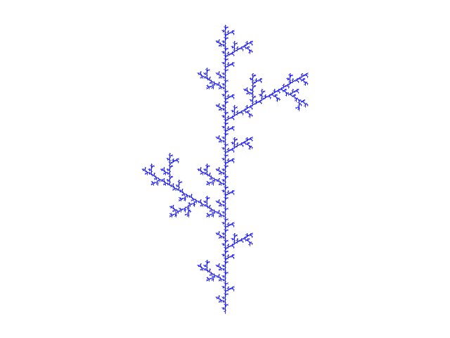

# beautiful-math

A collection of beautiful mathematical visualizations.

## Recursive Fractal Tree

This project implements a recursive fractal tree algorithm adapted from _The Beauty of Fractals: Six Different Views_ (Chapter 1 - Mathscapes - Fractal Scenery) by Anne M. Burns.

